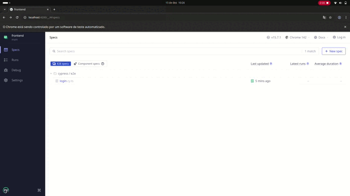
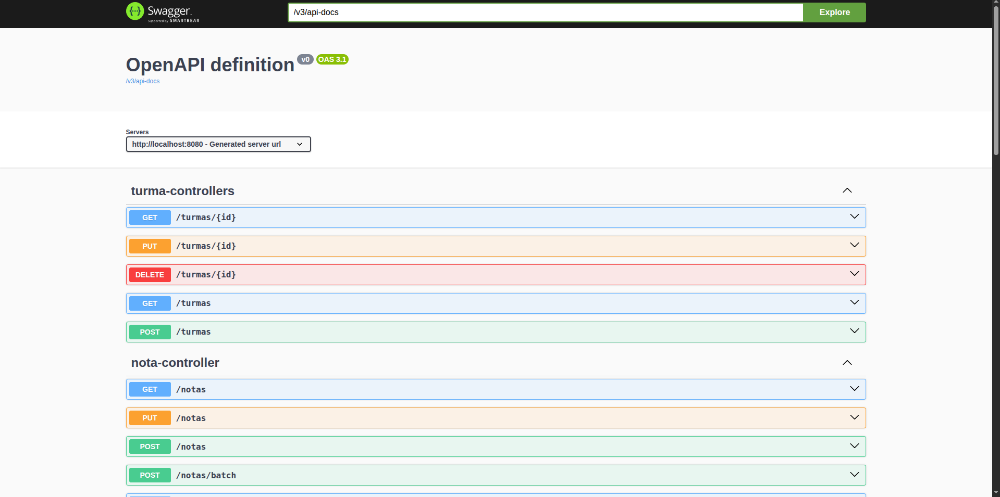

 

<p align="center">
  <a href="https://github.com/Denisson-Pereira/desafio-tecnico-desenvolvedor-senior-full-stack"></a>
  <a href="https://github.com/Denisson-Pereira/desafio-tecnico-desenvolvedor-senior-full-stack/issues"></a>
  <a href="https://github.com/Denisson-Pereira/desafio-tecnico-desenvolvedor-senior-full-stack/graphs/contributors"></a>
  <a href="https://github.com/Denisson-Pereira/desafio-tecnico-desenvolvedor-senior-full-stack/commits/main"></a>
  <a href="https://github.com/Denisson-Pereira/desafio-tecnico-desenvolvedor-senior-full-stack/stargazers"></a>
</p>


# 📝 Sumário

1. [Sobre o Projeto](#-sobre-o-projeto)
   - [Backend](#backend)
      - [Stack Back](#stack-back)
   - [Frontend](#frontend)
      - [Stack Front](#stack-front)
2. [Pré-requisitos](#-pré-requisitos)
3. [Como Executar o Projeto](#-como-executar-o-projeto)
   - [Clonar Repositório Git](#-clonar-repositório-git)
   - [Acessar Backend](#-acessar-backend)
   - [Rodar a Web](#rodar-a-web)
4. [Executar testes no frontend](#-executar-testes-no-frontend)
   - [Interativamente](#interativamente)
   - [Modo headless](#modo-headless)
5. [Documentação](#-documentação)
6. [Monitoramento com Prometheus](#monitoramento-com-prometheus)
7. [Edição](#-edição)   
8. [Aguarde! Ainda Não Terminou!](#-aguarde-ainda-não-terminou)
9. [Referências Bibliográficas](#-referências-bibliográficas)

# 📑 Sobre o projeto 

Sistema para registrar notas de alunos por disciplina e turma, com cálculo automático da média ponderada.

## Backend

O projeto foi desenvolvido em **Java 17** com **Spring Boot 3**, seguindo a **Clean Architecture** e utilizando o **padrão Repository** para consultas, garantindo que a lógica de negócio dependa de interfaces e não de implementações, seguindo o **Princípio da Inversão de Dependência**. Cada classe e módulo respeita o **Princípio da Responsabilidade Única**, garantindo que tenham apenas uma responsabilidade clara. O código também é estruturado para ser aberto para extensão e fechado para modificação, seguindo o **Princípio Aberto/Fechado**, e adota práticas para evitar duplicação, seguindo o **DRY** (*Don't Repeat Yourself*).

Além disso, o projeto inclui **Rate Limiting** para controlar o número de requisições e prevenir ataques, **Docker** para containerização, **Git hooks** com execução automática de testes via *pre-commit*, tratamento de exceções personalizado focado em regras de negócio, além de **schema** para criação do banco (**H2**) e **seed** para dados iniciais. Todo o desenvolvimento segue padrões de commits padronizados para manter consistência e organização do histórico do projeto. Os **Testes** também são executados automaticamente em um **pipeline** de Integração Contínua (**CI**) com **GitHub Actions**, garantindo que todas as alterações sejam validadas.

### Stack back

[](https://www.java.com/)

[](https://spring.io/)


[](https://junit.org/junit5/)
[](https://site.mockito.org/)


## Frontend

Foi desenvolvido com **Angular 16** usando Angular **CLI** e **Reactive Forms**, adotando **DTOs** para as requisições e garantindo comunicação consistente com o *back-end*. A interface foi estilizada com **CSS3** e **Media Queries** para responsividade, seguindo o **DRY** e princípios de **Responsabilidade Única**, componentização e separação de preocupações.

### Stack front


[](https://www.cypress.io/)


# ⚙ Pré-requisitos

**Certifique-se de ter o o Java 17**

Antes de mais nada, é necessário verificar se o Java 17 está instalado em sua máquina. Você pode baixá-lo e instalá-lo a partir do site oficial da Oracle.


**Certifique-se de ter o Node.js e o npm**

Antes de iniciar o projeto, é necessário verificar se o Node.js e o npm estão instalados em sua máquina. Você pode baixá-los e instalá-los a partir do site oficial do Node.js.


# 🚀 Como executar o projeto


## 👯 Clonar repositório git

```
git clone https://github.com/Denisson-Pereira/desafio-tecnico-desenvolvedor-senior-full-stack.git
```


## 🏧 Acessar Backend

Após clonar o repositório, para acessar o backend, basta digitar o seguinte comando no terminal:

```
cd backend
```

Você pode rodar a aplicação com o seguinte comando:

```
mvn spring-boot:run
```

Esse comando irá compilar e rodar a aplicação diretamente no terminal.


## Rodar a Web

Após clonar o repositório, para acessar o frontend, basta digitar o seguinte comando no terminal:

```
cd frontend
```

Para ver o projeto, certifique-se de que o backend está rodando e digite:

```
npm run start
```

Esse comando é usado para iniciar um projeto.

🚨 Para facilitar o uso, todas as rotas estão públicas. Portanto, o usuário pode acessar diretamente /home ou, caso queira, passar pelo login para utilizar esses dados mockados:

```
email: user@teste.com
senha: 123456
```

# 🧪 Executar testes no frontend

## Interativamente
```
npx cypress open
```

 

## Modo headless
```
npx cypress run
```

# 📱 Documentação

Para acessar a documentação da API, basta visitar a URL:

```
http://localhost:8080/swagger-ui/index.html
```

 


# Monitoramento com Prometheus

Para acessar as métricas coletadas pelo Micrometer, no formato compatível com o Prometheus para monitoramento, basta visitar:

```
http://localhost:8080/actuator/prometheus
```

# 📺 Edição

No desenvolvimento deste projeto, foram utilizados os seguintes editores:


# 🚨 Aguarde! Ainda não terminou!

>Este repositório representa apenas um MVP. Para facilitar o uso, todas as rotas estão públicas e o CORS foi liberado; contudo, em um cenário real, a configuração seria diferente. Para autenticação, seria utilizado o Spring Security, com tokens JWT de curta duração configurados como HttpOnly. Além disso, uma camada extra de segurança seria implementada, incluindo o uso de refresh tokens armazenados no banco de dados. No front-end, o estado do usuário seria gerenciado globalmente, por exemplo, utilizando NgRx.


# 📝 Referências Bibliográficas  

MARTIN, S. R. **Código Limpo: Habilidades Práticas do Agile Software**. Rio de Janeiro: Alta Books, 2011.
MARTIN, S. R. **Arquitetura Limpa: O Gui do Artesão para Estrutura e Design de Software**. Rio de Janeiro: Alta Books, 2018.